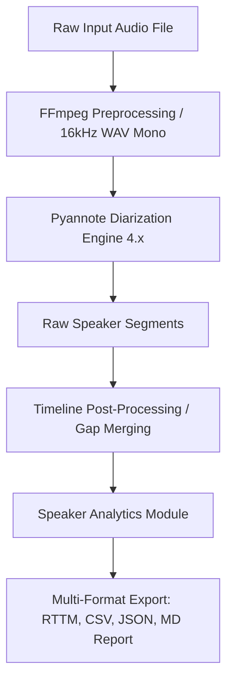

# Pipeline Architecture: Advanced Speaker Diarization (Pyannote 4.x)

This document outlines the architectural design for the speaker diarization pipeline, which standardizes raw multi-speaker discussion audio, runs deep clustering via Pyannote 4.x, post-processes the timeline, and outputs analytics and timelines in multiple structured formats.

---

## 📋 Pipeline Overview

* **System Objective**: To segment multi-speaker audio recordings (e.g. outreach discussions, interviews) and attribute exact start/end time brackets to each individual speaker without relying on transcription.
* **Core Approach**: A single, optimized stream consisting of input validation, standardization, speaker embedding clustering, turn-merging, and analytical report serialization.

---

## 🛠️ System Component Breakdown

### 1. Ingestion & Audio Standardization Module
* **Inputs**: Accepts raw audio files in any standard format (`.m4a`, `.mp3`, `.wav`, etc.) directly from Google Drive or local uploads.
* **Standardization**: Uses FFmpeg to convert the input dynamically to a standard **16kHz single-channel (mono) PCM 16-bit WAV** file.
* **Purpose**: Pyannote's VAD and clustering models are trained specifically on 16kHz mono audio. Standardizing the file beforehand prevents crop-related `ValueError` crashes and sample rate mismatches.

### 2. Diarization Engine (Pyannote Audio 4.x)
* **Model**: Leverages the state-of-the-art `pyannote/speaker-diarization-community-1` pipeline running on a T4 GPU.
* **Clustering Constraints**: Allows passing optional speaker count parameters (`num_speakers`, `min_speakers`, `max_speakers`) to restrict clustering or operates in fully automatic mode.
* **Outputs**: Raw speaker segments with start/end timestamps and assigned speaker labels (e.g., `SPEAKER_00`, `SPEAKER_01`).

### 3. Timeline Post-Processing & Refinement
* **Gap Merging**: Combines consecutive turns of the same speaker if the silence gap between them is smaller than a customizable threshold (default: `1.5s`).
* **Purpose**: Smooths out tiny breaks in speech (like breaths or short pauses) to create a natural, readable timeline of conversation flow.

### 4. Speaker Analytics Module
* **Duration Metrics**: Calculates the total speaking time (seconds) for each unique speaker.
* **Voice Share**: Computes the percentage of the discussion occupied by each speaker.
* **Turn Counting**: Records how many separate times each speaker initiated or took over the conversation.

---

## 📅 Sequential Data Flow

* **Step 1: File Check & Naming**: The file path is checked for existence. The base filename (e.g., `interview1`) is extracted to dynamically name output assets.
* **Step 2: Standardization**: The file is resampled via FFmpeg and saved locally to prevent backend crashes.
* **Step 3: Diarization**: Pyannote loads the model from Hugging Face (authenticated via `HF_TOKEN`) and processes the audio on the GPU.
* **Step 4: Timeline Processing**: Gaps are merged, and speaker speaking statistics are computed.
* **Step 5: File Serialization**: The refined timeline and analytics are saved to:
  * `[audio_name]_timeline.rttm` (Industry standard format)
  * `[audio_name]_timeline.csv` (Tabular view for spreadsheets)
  * `[audio_name]_timeline.json` (Structured array for software integrations)
  * `[audio_name]_diarization_report.md` (Rich Markdown report with tables and bar charts)
