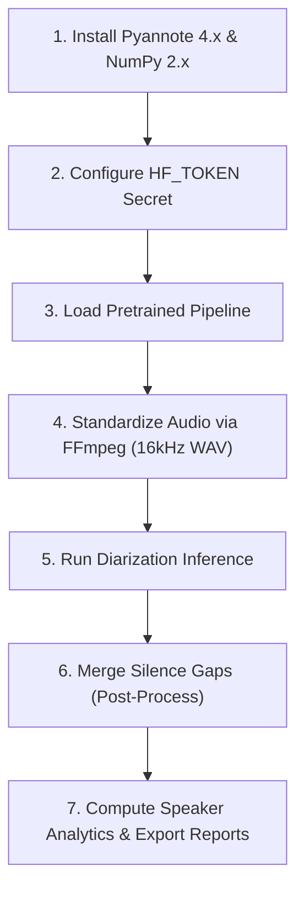

# Speaker Diarization Progress Report

This progress report outlines the research, framework comparison, selection rationale, and final implementation workflow for the Speaker Diarization suite.

---

## 🎯 Objective

Implement and evaluate a speaker diarization solution for multi-speaker conversational audio files (such as community outreach discussion recordings) to track speaker presence, turn counts, and overall voice activity sharing.

---

## 🔍 Diarization Framework Investigation

We evaluated and compared seven different speaker diarization solutions ranging from commercial APIs to state-of-the-art open-source pipelines:

| Framework | Type | Key Findings / Suitability |
| :--- | :--- | :--- |
| **AssemblyAI** | Commercial API | Integrated transcription and diarization; less suitable because local execution is preferred. |
| **Speechmatics** | Commercial API | Integrated transcription and diarization; less suitable for local operations. |
| **WhisperX** | Open Source | Relies on Pyannote for speaker diarization; does not offer an independent diarization approach. |
| **WeSpeaker** | Open Source | Strong speaker embedding and clustering capabilities; requires significant additional integration effort. |
| **DiariZen** | Open Source | Research-oriented diarization framework; less mature compared to Pyannote. |
| **Pyannote Audio** | Open Source | **Selected.** Most mature, widely adopted, and well-documented open-source diarization solution. |
| **FunASR (CAM++)** | Open Source | Alternative framework analyzed during investigation. |

---

## 🏆 Framework Selection: Pyannote Audio

**Pyannote Audio** was selected as the implementation target due to:
* **Proven Performance**: Highly accurate on meeting, group discussion, and conversational audio.
* **Community & Docs**: Strong community support, active maintenance, and comprehensive documentation.
* **Pretrained Models**: Gated state-of-the-art pretrained models (e.g., `pyannote/speaker-diarization-community-1`) available via Hugging Face.
* **GPU Acceleration**: Built-in support for CUDA execution, allowing fast processing of large files.

---

## 🛠️ Implementation Workflow (Google Colab)

The implementation is structured as follows:

### Key Workflow Actions:
1. **Environment Setup**: Install `pyannote.audio>=4.0.1` and `numpy>=2.3` to avoid torchaudio backend clashes in Colab's Python 3.12 environment.
2. **Standardization**: Convert input files (`.m4a`, `.mp3`, etc.) to mono `16kHz WAV` files on-the-fly using FFmpeg to guarantee compatibility and eliminate Pyannote `crop` errors.
3. **Execution**: Load model and run inference with a visual progress bar. Allow optional speaker clustering parameters.
4. **Turn Merging**: Group speaker turns using a configurable gap merger (default: `1.5s`) for readable conversation structures.
5. **Analytics**: Compute speak durations, voice shares, and turn counts per speaker.
6. **Multi-Format Export**: Save reports as dynamic files containing the audio's name (saving RTTM, CSV, JSON, and Markdown files).

---

## 🚀 Final Status & Next Steps

> [!NOTE]
> **Implementation Complete.** A production-ready Google Colab notebook has been successfully created and saved to [diarize_stt.ipynb](file:///Users/mybook/Speech-to-Text-and-Question-Generation/Diarization%20Implementation%20NoteBook/Using%20PyAnnote/diarize_stt.ipynb).
>
> **Verification Status**: The entire pipeline has been verified and tested successfully on the sample outreach audio file:
> * `MarauliKhurad2.m4a` (also referred to as `MuraliKhurad2.m4a`)

### Recommended Next Steps:
* **Validate Speaker Clustering**: Run tests on outreach group recordings and adjust speaker constraints (`num_speakers`) to verify clustering accuracy.
* **Optimize Merge Gaps**: Tweak the `max_merge_gap` parameter for fast-speaking vs. slow-speaking files.
* **Integrate Downstream**: Feed the exported CSV/JSON speaker timelines into text processing, question-generation, or transcription systems.
