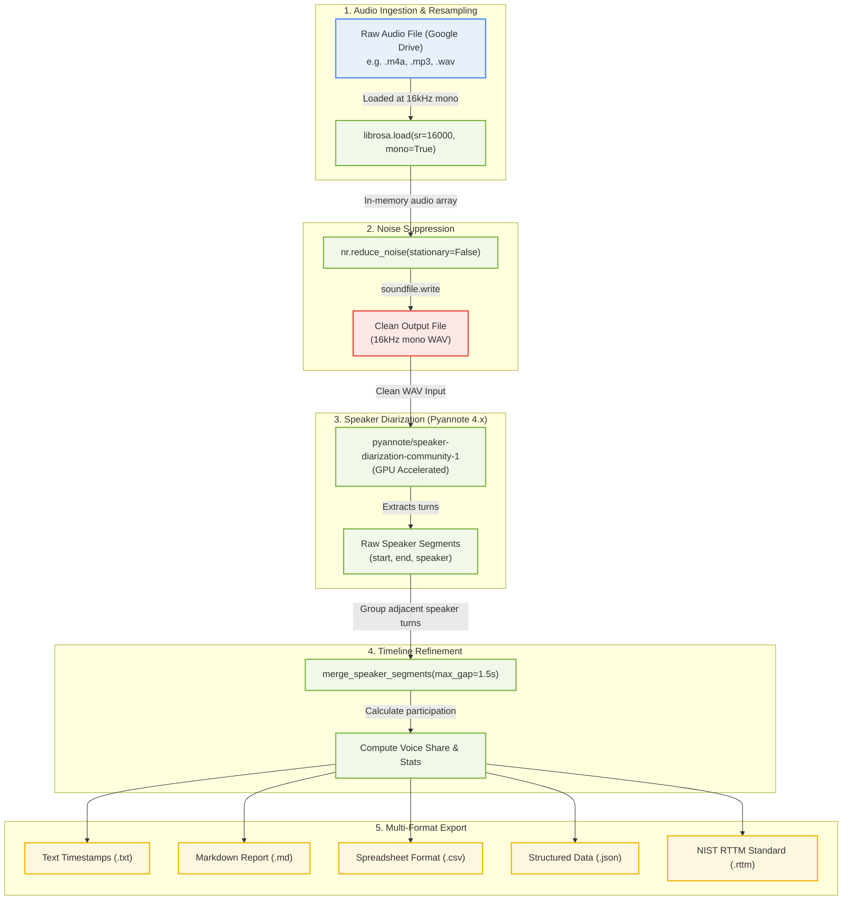

# 🎙️ Unified Noise Suppression & Speaker Diarization Pipeline

This document showcases the visual flow of the unified audio preprocessing, noise reduction, and speaker diarization system. It walks through how raw audio is ingested, cleaned, processed, and ultimately serialized into various report formats.

---

## 🗺️ Visual Pipeline Flow

The flowchart below displays the sequence of steps, tracking how data is loaded, saved, and transformed throughout the execution:

### 📦 Box Diagram Flowchart

```text
┌────────────────────────────────────────────────────────┐
│               1. Google Drive Input File               │
│               (e.g., .m4a, .mp3, .wav)                 │
└───────────────────────────┬────────────────────────────┘
                            │ (File Path)
                            ▼
┌────────────────────────────────────────────────────────┐
│          2. Ingestion, Resampling & Denoising          │
│  - Ingest file via librosa.load(sr=16000, mono=True)   │
│  - Run noisereduce (stationary=False, prop=0.85)       │
└───────────────────────────┬────────────────────────────┘
                            │ (Clean Float Audio Array)
                            ▼
┌────────────────────────────────────────────────────────┐
│              3. Denoised WAV File Export               │
│  - Saved to folder: drive/MyDrive/Cleaned_Audio/       │
│  - Filename format: {audio_name}_cleaned.wav           │
└───────────────────────────┬────────────────────────────┘
                            │ (WAV Input)
                            ▼
┌────────────────────────────────────────────────────────┐
│         4. Speaker Diarization (Pyannote 4.x)          │
│  - Ingest standardized 16kHz Mono Cleaned WAV          │
│  - Run neural model community-1 on GPU                 │
└───────────────────────────┬────────────────────────────┘
                            │ (Raw Timestamps)
                            ▼
┌────────────────────────────────────────────────────────┐
│            5. Refinement & Timeline Merging            │
│  - Merge adjacent speaker turns if gap < 1.5s          │
│  - Calculate voice share % and speaking metrics        │
└───────────────────────────┬────────────────────────────┘
                            │ (Processed Analytics)
                            ▼
┌────────────────────────────────────────────────────────┐
│              6. Multi-Format Serializers               │
│  Outputs saved to: drive/MyDrive/Diarization_Outputs/  │
│  - [TXT]   {audio_name}_diarization_timestamps.txt     │
│  - [MD]    {audio_name}_diarization_report.md          │
│  - [CSV]   {audio_name}_timeline.csv                   │
│  - [JSON]  {audio_name}_timeline.json                  │
│  - [RTTM]  {audio_name}_timeline.rttm                  │
└────────────────────────────────────────────────────────┘
```

### 🧬 Mermaid Architectural Layout



---

## 🔍 Detailed Component Descriptions

### 1. Ingestion & Audio Standardization
* **Goal**: Prepare the audio for Pyannote to prevent value mismatch crashes.
* **Mechanism**: Ingests files (MP3, M4A, WAV, etc.) and uses `librosa` to automatically resample the audio to **16kHz mono** directly in memory. This eliminates the need for separate external FFmpeg preprocessing.

### 2. Dynamic Noise Suppression
* **Goal**: Filter out ambient noise and secondary background talk.
* **Mechanism**: Runs the `noisereduce` algorithm with `stationary=False` to dynamically adapt to shifting chatter. The denoised float array is saved as a physical WAV file in the configured **`cleaned_audio_folder`** path.

### 3. Diarization Engine (Pyannote 4.x)
* **Goal**: Attribute exact timestamps to distinct speaker labels.
* **Mechanism**: Loads the latest neural model from Hugging Face and processes the cleaned wav file using the Colab T4 GPU to isolate individual speech prints.

### 4. Timeline Refinement
* **Goal**: Merge speech gaps to make the log readable.
* **Mechanism**: Combines consecutive turns of the same speaker if the gap between them is less than a customizable threshold (default `1.5s`). It then aggregates speech duration, turn count, and speech percentage for each speaker.

### 5. Multi-Format Serialization
* **Goal**: Deliver timelines in multiple formats suited to different use cases:
  * **Plain Text (`.txt`)**: A clean timeline layout showing speaker labels and brackets (e.g. `[00:05 - 00:20] SPEAKER_00`).
  * **Markdown Report (`.md`)**: A report with voice share percentages, turn counts, and a visual share of speech chart.
  * **RTTM (`.rttm`)**: The industry-standard format for compatibility with other speech tools.
  * **CSV & JSON (`.csv`, `.json`)**: Tabular data and developer-friendly structured logs.

---

## 📂 Output Folder Structure

When the notebook completes, files are organized as follows:

```
[Google Drive / content]
 ├── drive/MyDrive/
 │    ├── Cleaned_Audio/
 │    │    └── {audio_name}_cleaned.wav
 │    │
 │    └── Diarization_Outputs/
 │         ├── {audio_name}_diarization_timestamps.txt   <-- (Clean Text Log)
 │         ├── {audio_name}_diarization_report.md         <-- (Premium Report)
 │         ├── {audio_name}_timeline.csv
 │         ├── {audio_name}_timeline.json
 │         └── {audio_name}_timeline.rttm
```
